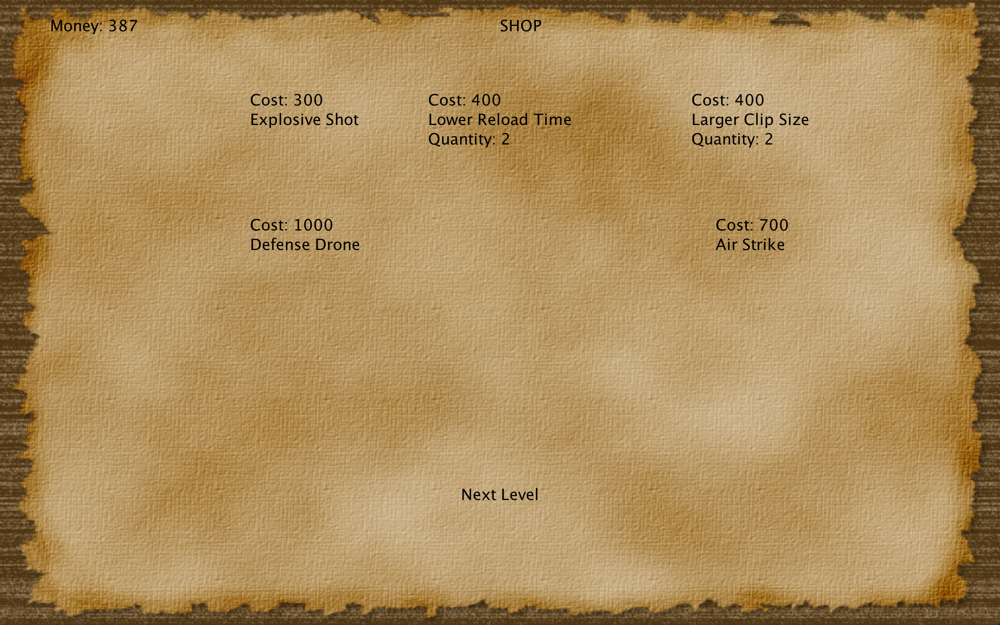

This is a game that I made in java. The player controls the cannon on top of the tower and is try to defend against the invaders. Click on the screen and the cannon will shoot in that direction. The helicopters will constantly shoot at the tower, damaging it, and the enemies on the ground will walk towards the tower and attack it when they reach it.

There are ten levels total and in between each level the player can buy upgrades in a shop.

